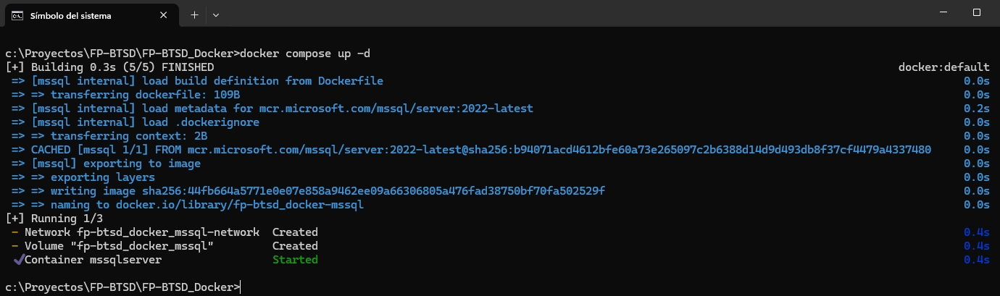
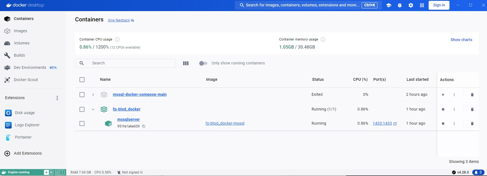
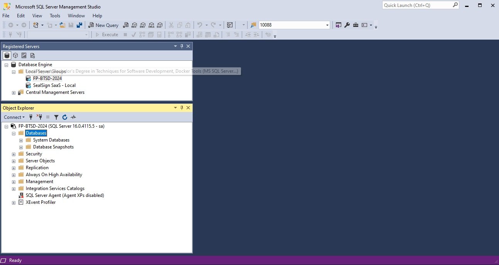
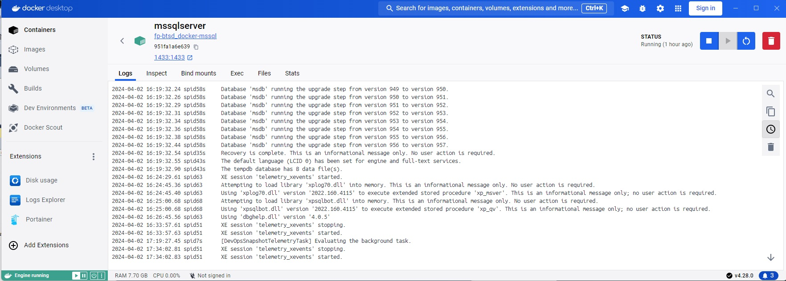

<!-- PROJECT LOGO -->
<br />
<div align="center">
  
  <h3 align="center">README.MD</h3>

  <p align="center">
    This file contains the instructions for the local deployment of the "Docker" container of the Microsoft SQL Server database manager in its latest version.
    <br />
  </p>
</div>

<!-- TABLE OF CONTENTS -->
<details>
  <summary>Table of contents</summary>
  <ol>
    <li><a href="#introduction">Introduction</a></li>
    <li><a href="#requirements">Requirements</a></li>
    <li><a href="#installation">Installation</a></li>
    <li><a href="#instructions">Instructions</a></li>
    <li><a href="#documentation">Additional documentation</a></li>
  </ol>
</details>

<!-- INTRODUCTION -->
## Introduction
<div id="introduction"></div>

The objective of this project is to provide the development team with the local infrastructure on their PC to provision a dockerised SQL Server database. The main benefit is to be able to develop the product locally without the need to connect to the shared database. In a few minutes you get a copy of the local database manager ready for operation.

<!-- REQUIREMENTS -->
## Requirements
<div id="requirements"></div>

A local copy of the Docker Desktop product for Windows PCs is required and can be downloaded from the following link: 

[Docker website](https://www.docker.com)

<!-- INSTALLATION -->
## Installation
<div id="installation"></div>

Clone the repository to a local folder and run the command:

```def
        docker compose up -d
```

<div id="block" align="center">
    <div class="inline-block" style="display: inline-block; width: 30%">
        
    </div>
</div>


<!-- INSTRUCTIONS -->
## Instructions
<div id="instructions"></div>

Use the following commands to start, stop or list all available deployeded containers:

```def
        docker ps -a					# Get a list of all available containers
        docker start [container_namer_or_ID]		# Start a container
        docker stop [container_namer_or_ID]		# Stops a container
```

<div id="block" align="center">
    <div class="inline-block" style="display: inline-block; width: 30%">
        
    </div>
    <br>
    <div class="inline-block" style="display: inline-block; width: 30%">
        
    </div>
    <br>
    <div class="inline-block" style="display: inline-block; width: 30%">
        
    </div>
</div>


<!-- DOCUMENTATION -->
## Documentation
<div id="documentation"></div>

Additional information on MS SQL Server configuration can be found at the following link:

[Configure SQL Server on Linux](https://learn.microsoft.com/en-us/sql/linux/sql-server-linux-configure-environment-variables)